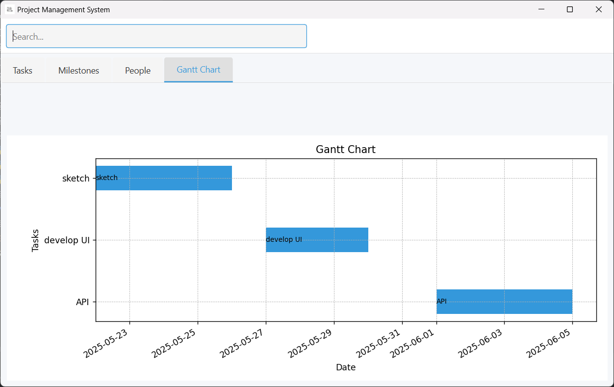

# Project Management System

## Project Description
The Project Management System is a desktop application built with Python using the PyQt6 framework, designed to streamline project management tasks. This application allows users to manage tasks, milestones, and people involved in a project through an intuitive graphical user interface (GUI). It integrates a SQLite database for persistent storage and includes features such as task assignment, milestone tracking, and Gantt chart visualization. The system supports CRUD (Create, Update, Delete) operations for all entities and provides filtering and export capabilities to enhance productivity.

Key features include:
- **Task Management**: Add, update, and delete tasks with details like title, status, priority, and dates, assigned to specific individuals.
- **Milestone Tracking**: Create and manage milestones to mark significant project phases.
- **People Management**: Register and update details of project team members.
- **Gantt Chart Visualization**: Visualize task timelines with an interactive Gantt chart.
- **Data Export**: Export task data to CSV files for reporting or backup purposes.
- **Search and Filter**: Quickly find and filter tasks, milestones, and people by name or title.

The application leverages a repository pattern for data access, entity classes for data modeling, and matplotlib for chart rendering, ensuring a robust and scalable architecture.

## Screenshots

### Tasks Tab
The Tasks tab displays a table of tasks with columns for title, status, priority, start date, due date, and assigned person. Users can add, update, delete, or export tasks to CSV.


### Milestones Tab
The Milestones tab shows a list of milestones with their names, allowing users to add, update, or delete milestones.


### People Tab
The People tab lists team members with their names, emails, and roles, supporting add, update, and delete operations.


### Gantt Chart Tab
The Gantt Chart tab provides a visual representation of task timelines, helping users track progress over dates.



## Logging
The application uses Python's `logging` module to record events, errors, and informational messages during its operation. The logging configuration is set up in `config.py` with the following details:
- **Log Level**: INFO (captures informational messages and higher severity levels like WARNING, ERROR, and CRITICAL).
- **Log File**: Logs are written to a file named `project_management.log` in the project root directory.
- **Log Format**: Each log entry includes a timestamp, the log level, and the message (e.g., `2025-05-25 12:31:00,123 - INFO - Created task: Design UI`).

This logging mechanism helps with debugging and monitoring the application's behavior. For example, it logs successful operations like task creation and errors such as database connection issues. To view logs, open the `project_management.log` file in the project root.


## How to Run the Project

### Prerequisites
Ensure you have the following installed on your system:
- **Python 3.8+**: The application is written in Python.
- **pip**: Python's package manager to install dependencies.
- **Git** (optional): If cloning the repository from a version control system.

### Setup Instructions
1. **Download the Project**:
    Download and extract the project files to a directory.

2. **Install Dependencies**:
   The project dependencies are listed in the `requirements.txt` file. Install them using the following command:
   ```bash
   pip install -r requirements.txt
   ```
   - The `requirements.txt` file includes:
     - `PyQt6`: For the GUI framework.
     - `matplotlib`: For rendering the Gantt chart.
   - SQLite support is built into Python via the `sqlite3` module, so no additional installation is needed for the database.

3. **Verify the Database**:
   The application uses a SQLite database located at `logic/project_management.db`. This file should be present in the `logic` directory. If it’s missing, you may need to create or initialize the database (refer to the project’s documentation or scripts for database schema setup if provided).

4. **Run the Application**:
   Execute the main script to launch the GUI:
   ```bash
   python main.py
   ```

## Outlook
The Project Management System is designed with future enhancements in mind. Potential improvements include:
- **Multi-User Support**: Implement user authentication and role-based access control to support collaborative environments.
- **Advanced Filtering**: Add more sophisticated filters (e.g., by status, priority, or date range) to improve data navigation.
- **Real-Time Updates**: Integrate WebSocket or similar technology for real-time task and milestone updates across multiple instances.
- **Mobile Compatibility**: Develop a mobile version or responsive design to allow access on various devices.
- **Additional Visualizations**: Include pie charts for task distribution or burndown charts for sprint tracking.
- **API Integration**: Add an API to allow external applications to interact with the system.

The current version serves as a solid foundation, and with iterative development, it can evolve into a comprehensive project management tool suitable for small to medium-sized teams.